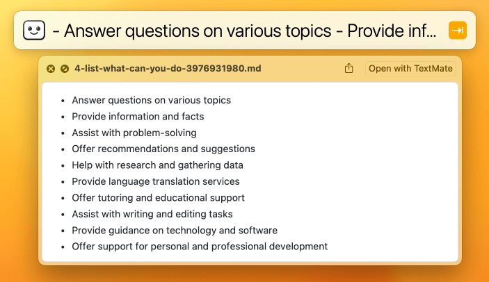

# ChipiChat: LaunchBar🥂ChatGPT

A [LaunchBar](https://www.obdev.at/products/launchbar/) action to interact with the [ChatGPT](https://chat.openai.com/chat) [API](https://platform.openai.com/docs/models/chatgpt). Responses are received directly in LaunchBar and can be browsed, opened, previewed with Quick Look, inserted, or sent to another action. Conversation history is preserved for context. Responses are cached on disk. Understands keyword modifiers and commands. ChatGPT system messages are configurable via personas. *Requires an OpenAI API key.*


## Usage

Open ChipiChat in LaunchBar, hit the spacebar, enter a command or message, then hit return to send it to ChatGPT.

The input will be taken from the clipboard if no text is entered into LaunchBar. This enables a powerful workflow to quickly pass text through ChatGPT.

As an example, here’s how you can send text on the clipboard to ChatGPT using the *rewrite* persona, and immediately insert the response into the frontmost document:

1. Select and copy text in a document.
2. Invoke ChipiChat.
3. Type `rewrite` to use the *rewrite* persona.
4. Hold `⇧` *(shift)* and hit `↵` *(return)* to use the *insert immediately* function.
5. ChatGPT’s response replaces the selected text.

### Response manipulation

- **`⌘ ↵`** *(command + return)* Open the response in your text editor.
- **`⇧ ↵`** *(shift + return)* Insert the response at the current cursor position.
- **`⌃ ↵`** *(control + return)* Quick Look the response.
- **`⌘ Y`** Quick Look the response.
- **`⌘ C`** Copy the response to the clipboard.
- **`↵`** *(return)* Open the response in your text editor (reconfigurable using the `default_action` [config option](#options)).
- **`→`** *(right-arrow)* Browse the response as a list (ideal for acting on specific lines of text).
- **`⇥`** *(tab)* Send the text to other LaunchBar targets, e.g., send the output to a friend by passing it to the Compose Message action.

### Keyword modifiers

Prefix your message with one-or-more modifiers for enhanced functionality:

- **`(persona name)`**: Use a predefined or custom [persona](#personas).
- **`N.N`**: Adjust response randomness by using the specified temperature value, e.g., “1.0 why is the sky blue?”.
- **`4`**: Use the GPT-4 model (requires GPT-4 API access).
- **`copy`**: Automatically copy the response to the clipboard.
- **`image`**: Generate an image with DALL·E and return the image URL.
- **`new`**: Start a new conversation with no history.
- **`transient`**: Exclude conversation history for this message.

You can combine modifiers, e.g., “*code copy 4* js uuid function” sends “js uuid function” to *GPT-4* API with the *code persona* and *copies the response*. All modifiers must go at the beginning of the message.

### Commands

Manage conversation history, settings, and personas by sending commands to ChipiChat:

- **`help`**: Display a short user guide.
- **`history`**: Display recent conversation history.
- **`export`**: Save conversation history to a file in ~/Downloads/.
- **`clear`**: Erase all conversation history (otherwise, conversations are saved for the duration defined by the `history_expiration_days` config option).
- **`cache`**: Open the cache directory in the Finder.
- **`config list`**: Show current configuration settings.
- **`config reset`**: Reset all configuration options to default.
- **`config set OPTION VALUE`**: Set the configuration OPTION to VALUE, e.g., `config set default_action alert`.
- **`persona list`**: View a summary of personas.
- **`persona export`**: Save all personas and their prompts to a file in ~/Downloads/.
- **`persona delete NAME`**: Delete a persona.
- **`persona reset`**: Reset personas to default. This will erase any custom personas you added.
- **`persona set default SYSTEM_MESSAGE`**: Change the *default* persona’s system message.
- **`persona set NAME SYSTEM_MESSAGE`**: Add or modify a persona.
- **`redo`**: Regenerate the response using a random temperature between 0–1.
- **`version`**: Display ChipiChat version and check if a new version is available.

## Installation

### Get an OpenAI API key

Before you can use ChatGPT, you must get an OpenAI API key:

1. Create an [OpenAI account](https://platform.openai.com/signup).
2. Add a credit card in [Account → Billing → Payment methods](https://platform.openai.com/account/billing/payment-methods).
3. [Create a new secret API key](https://platform.openai.com/account/api-keys).

### Install ChipiChat

1. Download `ChipiChat.lbaction.zip` from [releases](https://github.com/quinncomendant/ChipiChat.lbaction/releases)
2. Unzip it, and double-click the resulting `ChipiChat.lbaction` file to install (or manually move it into `~/Library/Application Support/LaunchBar/Actions/`).
3. Run the following command in Terminal.app to allow this unsigned action to run (otherwise [macOS Gatekeeper](https://support.apple.com/guide/security/gatekeeper-and-runtime-protection-sec5599b66df/web) will [complain](https://send.strangecode.com/f/gatekeeper-warning.png)):
```bash
xattr -d com.apple.quarantine ~/Library/Application\ Support/LaunchBar/Actions/ChipiChat.lbaction
```
3. Open LaunchBar and type `cc` to invoke ChipiChat. 
4. Hit the spacebar, type `config set api_key YOURAPIKEYHERE`, and hit return to save your API key in LaunchBar:


(Alternatively, you can use `export OPENAI_API_KEY="…"` in your shell profile.)

Now you’re ready to use ChipiChat!

### Usage example

Invoke ChipiChat, hit the spacebar, then type a message and hit return:


After a couple seconds, you receive the response:


That’s a bit hard to read because not all the response text is visible, but if you press the right-arrow key, you can view it as a list:


Or, you can view it in Quick Look (press the left-arrow key to go back, then press `⌘ Y` or `⌃ ↵`):



ChipiChat has many features and myriad customizable options. Practice all the commands listed in [usage](#usage) and adjust the [configuration options](#configuration) until ChipiChat works exactly how you want it to.

## Updating

1. Run the `version` command to check for new versions.
2. Download the new `ChipiChat.lbaction.zip` file from [releases](https://github.com/quinncomendant/ChipiChat.lbaction/releases), unzip it, and double-click it to install.
3. Read the change log on the release page, which may have special instructions such as a requirement to run `config reset` after updating.

## Personas

Use a persona to set the overall behavior of the assistant. Create your own or use one of the predefined personas (`changelog`, `code`, `commit`, `complete`, `condense`, `expand`, `fix`, `list`, `reply`, `rewrite`, `safe`, `summarize`, `write`). A default persona is used if no persona is specified when you send a message.

Manage personas with these commands:

- **`persona list`**: View a summary of personas.
- **`persona export`**: Save all personas and their prompts to a file in ~/Downloads/.
- **`persona delete NAME`**: Delete a persona.
- **`persona reset`**: Reset personas to default. This will erase any custom personas you added.
- **`persona set default SYSTEM_MESSAGE`**: Change the *default* persona’s system message.
- **`persona set NAME SYSTEM_MESSAGE`**: Add or modify a persona.

The `SYSTEM_MESSAGE` is the [system message](https://platform.openai.com/docs/guides/chat/introduction) that is included with the request to ChatGPT that influences the behavior of the assistant.

As an example, to create a persona named “Pierre” which translates user messages to French:

```
persona set pierre Translate the user message to French
```

To use a persona, add the persona’s NAME to the beginning of your message. So, to use the Pierre persona, just write “*pierre* retirement in france must be amazing” and the assistant will respond, “La retraite en France doit être incroyable.” The persona can be combined with other keyword modifiers, e.g., “*copy* *list* mexican zombie films” to use the *list* persona and *copy* the results to the clipboard automatically.


## Configuration

The following options can be changed using the `config set OPTION VALUE` command. For example, to change the `default_action`:

```
config set default_action quicklook
```

To view currently-set values, send the `config list` command.

To reset all configuration options to default, send the `config reset` command.

### Options

- **`api_key`**: Your OpenAI API key (default: empty or imported from `$OPENAI_API_KEY`).
- **`cache_enable`**: If you prefer to have a fresh response for every message, set this to `false` (default: `true`).
- **`cache_expiration_minutes`**: How long before cached responses expire. This is useful to avoid loading a cached response for the same question in a different context, e.g., the message “please continue” might match a cached response from an earlier reply (default: `15`). If a message loads a cached response unexpectedly, you can reduce the cache expiration, clear the history, or just send the query again with extra characters that make it unique.
- **`cache_min_words`**: Minimum words in input text required before response is cached. Short phrases are less unique, and are more likely to load cached responses from a different context (default: `3`).
- **`default_action`**: The action to run when hitting return *after* receiving a response (options: `open`, `insert`, `quicklook`, `alert`, `copy`, `largetype`; default: `open`).
- **`default_action_auto`**: Set this to `true` to run the `default_action` automatically without having to hit return after receiving a response (options: `true`, `false`; default: `false`).
- **`hide`**: Set this to `true` to hide LaunchBar while waiting for a response from ChatGPT (options: `true`, `false`; default: `false`).
- **`history_expiration_days`**: How long before old messages are removed from the conversation history (default: `7`).
- **`filename_extension`**: The extension of cached files changes how they open in a text editor and Quick Look (options: `txt`, `md`, `markdown`; default: `txt`). If you have a Quick Look extension that supports Markdown (e.g., [Peek](https://apps.apple.com/us/app/peek-a-quick-look-extension/id1554235898?mt=12)), change this to `md` for syntax highlighting.
- **`max_history_minutes`**: Maximum age of conversation history to include in requests for context (default: `480`).
- **`max_history_tokens`**: Maximum amount of conversation history to include in requests for context (default: `1000`).
- **`max_response_tokens`**: Maximum amount of [tokens](https://platform.openai.com/docs/api-reference/chat/create#chat/create-max_tokens) to return in the response (default: `Infinity`).
- **`model`**: Which OpenAI [model](https://platform.openai.com/docs/models/overview) to use (default: `gpt-3.5-turbo`).
- **`temperature`**: What sampling [temperature](https://platform.openai.com/docs/api-reference/completions/create#completions/create-temperature) to use, between `0.0` and `2.0` (default: `0.1`).
- **`timeout`**: How many seconds to wait for a response from the API (default: `30`; using GPT-4 adds timeout + 120 seconds).

### Default actions

Use the `default_action` and `default_action_auto` options to customize your preferred interface for receiving responses. 

- **`open`**: Open the response in the default text editor. Hide LaunchBar.
- **`insert`**: Paste the contents of the response into the cursor position. Hide LaunchBar.
- **`quicklook`**: Open the response in Quick Look. LaunchBar remains open, so you can easily close the Quick Look (`Esc` key) and do something else with the response.
- **`alert`**: Open the response in a LaunchBar alert. Hit “Reply” to keep the conversation going (the cursor will return to the input field, ready to send the next message).
- **`copy`**: Copy the contents of the response on the clipboard. Hide LaunchBar.
- **`largetype`**: Open the response in a LaunchBar’s large type display. Only useful for short responses.

## Tips

If you use a Quick Look plugin that formats markdown with syntax highlighting (such as [Peek](https://apps.apple.com/us/app/peek-a-quick-look-extension/id1554235898?mt=12)), these settings will open every response in Quick Look:

```
config set filename_extension md
config set default_action quicklook
config set default_action_auto true
```

The best settings to carry on a conversation is to use LaunchBar alerts, which has a Reply button:

```
config set default_action alert
config set default_action_auto true
```

The `open` and `insert` actions are best for generating content, such as generating blog posts or emails.

The `open` and `quicklook` actions are best for generating code. Also press the right-arrow on a response to view it as a list of items, then copy–paste just the few lines that you need.

Remember, you can override the default action behavior by holding *command*, *shift*, or *control* when you hit return to *open*, *insert*, or *Quick Look* the response.

Press the right-arrow to view a response as a [list with icons](https://send.strangecode.com/f/chipichat-complex-response-as-list.png) representing parts of Markdown content 
( for code,
 for ordered list,
 for unordered list,
and  for all other text).

## Alternatives

- [@ptujec](https://twitter.com/ptujec)’s cuter [Ask ChatGPT](https://github.com/Ptujec/LaunchBar/tree/master/Ask-ChatGPT#launchbar-action-ask-chatgpt) LaunchBar action.
- [Chris Lemke](https://github.com/chrislemke)’s [ChatFred](https://github.com/chrislemke/ChatFred) Alfred workflow.
- [Awesome ChatGPT API](https://github.com/reorx/awesome-chatgpt-api) – Curated list of apps and tools you can use with your own API key.


## Support

Contact me on [Twitter](https://twitter.com/com), the [Fediverse](https://mastodon.social/@com), or create a [GitHub issue](https://github.com/quinncomendant/ChipiChat.lbaction/issues).

Do you find this free software useful? [Say thanks with a coffee!](https://ko-fi.com/strangecode)

----

[](docs/ChipiChat.jpg)

<style>
.icon-inline {
    width: 1em;
    height: 1em;
    vertical-align: -0.15em;
    box-shadow: none;
    background: none;
    margin: 0;
    page-break-before: unset;
}
</style>